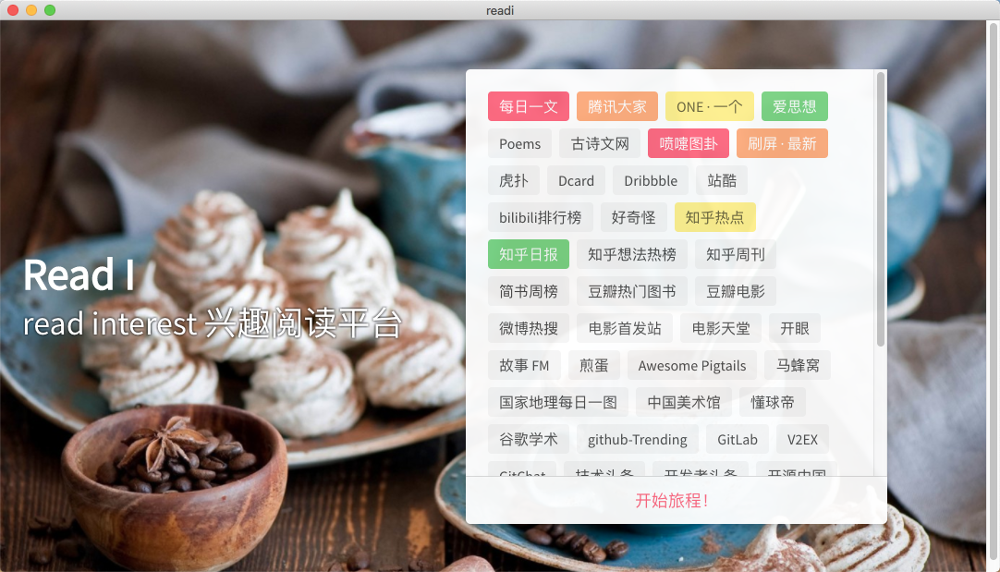

# readi

> an interest reading app 兴趣阅读 app
> 基于 electron 生成,可生成跨平台应用。
> 接口基于[RSSHub](https://github.com/DIYgod/RSSHub)

## 截图



## 下载地址

[win](https://pan.baidu.com/s/1ruIll-o-5DUwBSvyxoDLfQ) 密码:4vgj
[mac](https://pan.baidu.com/s/1CpUO8ND0lmTErDxGE3MvAA) 密码:proq

#### Build Setup

```bash
# install dependencies
npm install

# serve with hot reload at localhost:9080
npm run dev

# build electron application for production
npm run build

```

---

This project was generated with [electron-vue](https://github.com/SimulatedGREG/electron-vue)@[8fae476](https://github.com/SimulatedGREG/electron-vue/tree/8fae4763e9d225d3691b627e83b9e09b56f6c935) using [vue-cli](https://github.com/vuejs/vue-cli). Documentation about the original structure can be found [here](https://simulatedgreg.gitbooks.io/electron-vue/content/index.html).
